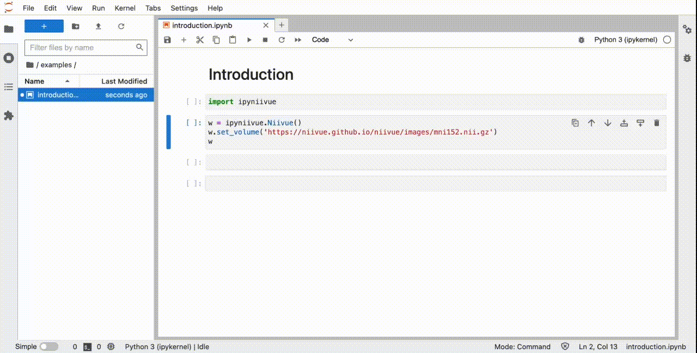

# ipyNiiVue

[](https://travis-ci.org/niivue/ipyniivue)
[](https://codecov.io/gh/niivue/ipyniivue)


ipyNiiVue is a Python / [Niivue](https://github.com/niivue/niivue) bridge for [Jupyter Widgets](https://jupyter.org/widgets). A Python API is used to interact with NiiVue.

## Getting started

### Installation
```sh
git clone https://github.com/niivue/ipyniivue
cd ipyniivue
yarn
yarn add https://github.com/AnthonyAndroulakis/niivue#thresholding
yarn run watch
```
Then, in a separate command line
```
jupyter lab
```

The `yarn add https://github.com/AnthonyAndroulakis/niivue#thresholding` step is temporary and will only exist until the thresholding branch of niivue gets published onto npm
      
To view changes made in the typescript, reload the jupyter page. To view changes made in the python, restart the kernel.

### Usage



