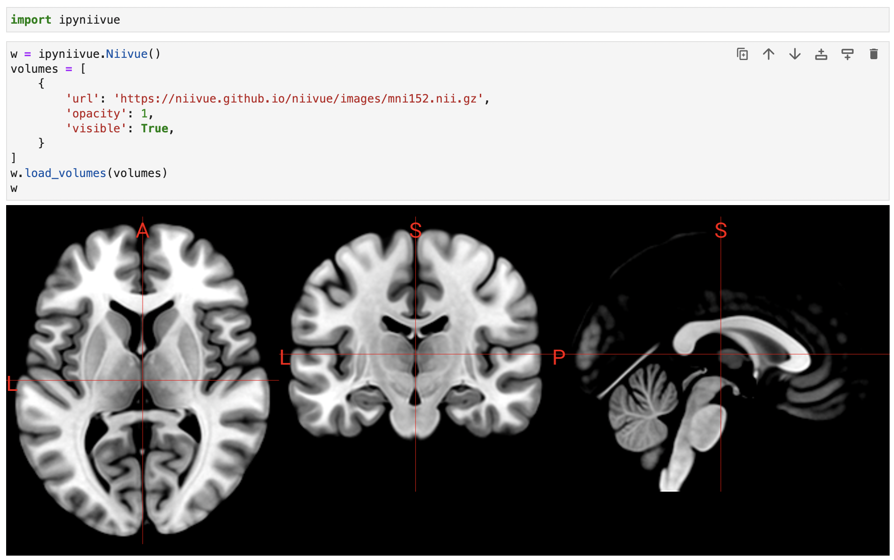

# ipyNiiVue

ipyNiiVue is a Python / [Niivue](https://github.com/niivue/niivue) bridge for [Jupyter Widgets](https://jupyter.org/widgets). A Python API is used to interact with NiiVue.

## Try it online
You can try ipyniivue online at [](https://colab.research.google.com/github/niivue/ipyniivue), [](https://anthonyandroulakis.github.io/ipyNiiVueLite/lab?path=introduction.ipynb), or [](https://mybinder.org/v2/gh/niivue/ipyniivue/main?urlpath=lab/tree/examples/introduction.ipynb).


## Getting started

### Installation
```sh
pip install ipyniivue
```

### Development
```sh
conda create -n ipyniivue-dev -c conda-forge nodejs yarn python jupyterlab=3.6.3
conda activate ipyniivue-dev
git clone https://github.com/niivue/ipyniivue.git
cd ipyniivue
yarn install
jupyter labextension develop --overwrite .
yarn run watch
```
Then, in another terminal/cmd window:
```sh
cd ipyniivue
conda activate ipyniivue-dev
jupyter lab
```

To view changes made in the typescript, reload the jupyter page. To view changes made in the python, restart the kernel.

### Usage
[documentation](docs)       
