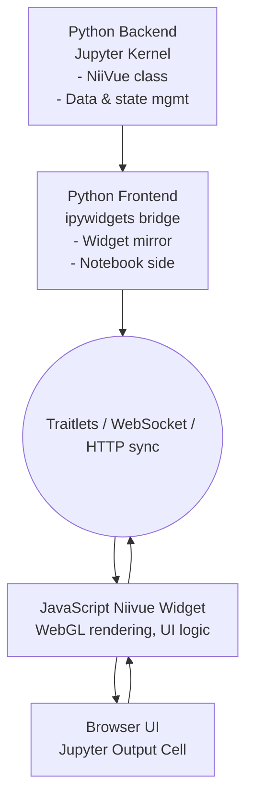

Architecture
============

Understanding the code base of IPyNiiVue is complicated by how JS interacts with Python, the intricacies 
of how Jupyter Notebooks works, and distinctions between the Python frontend and backend. 
The aim of this documentation is to clarify some of these interactions and the overall architecture of
IPyNiiVue.

How JavaScript, Python Backend, and Frontend Interact
============
At its core, ipyniivue is a Jupyter widget built with the anywidget framework that bridges
a WebGL-powered JavaScript visualization (Niivue) with Python logic in Jupyter notebooks.
Here's how the parts connect:

**Python Side:** The main interface in Python is the `NiiVue` class. Users instantiate objects of this 
class in a notebook (e.g., `nv = NiiVue()`), then load neuroimaging data using `nv.load_volumes([...])`.
Internally, `Volume`, `Mesh`, and `MeshLayer` objects define what gets rendered and how. Python 
communicates with the frontend via traitlet state changes over a Tornado-powered websocket, 
respecting anywidget conventions.

**JavaScript Side:** The JS code is under the `js/` directory, bundled using esbuild, and outputs into `src/ipyniivue/static`.
It integrates the Niivue rendering engine (`niivue.Niivue`) and handles WebGL visualization,
responding to commands like `setColormap`, `setOpacity`, `loadVolumes`, and many more.

**Frontend in the Browser:** Visual rendering appears inline in the Jupyter notebook. The JS
widget receives state updates (like new volumes or property changes) via websocket or HTTP
(in cases like Marimo). Large data (like imaging volumes) are transmitted in chunks from 
front to back to circumnavigate Tornado’s 10 MB message limit; reconstruction happens in 
the backend. When backend data changes, only diffs (indices + new values) get sent to the frontend
to update existing arrays efficiently

**In summary:**

- Python defines volumes/meshes and owns application logic.
- Anywidget syncs state between Python and JS.
- JS frontend renders and visualizes, while also sending large data back to 
  Python in a chunked manner when needed.

Detailed Architecture (Backend vs Frontend)
============

**Python Backend:** The Python backend runs inside the Jupyter kernel (e.g., IPython) and contains the actual
NiiVue Python object and logic for handling volumes, meshes, and layers. It is responsible for:

- Loading neuroimaging data (.nii, .nii.gz, etc.).
- Managing state of objects (opacity, colormap, etc.).
- Communicating updates via traitlets to the frontend.

It performs most of the computation and manage states.

**Python Frontend:** The Python frontend runs inside the Jupyter notebook client (browser)
but in Python’s interactive space. It relies on the ipywidgets framework which provides a 
Python “widget model” that mirrors the states of the backend object. It talks to the JavaScript 
side through traitlet synchronization. For the user, it looks like “the same Python object,” 
but really this part is just a mirror/sync layer living in the notebook frontend.

**JavaScript Side (true UI frontend):** The JS side contains the Niivue WebGL widget that 
actually renders  the brain images and responds to mouse/keyboard input.

